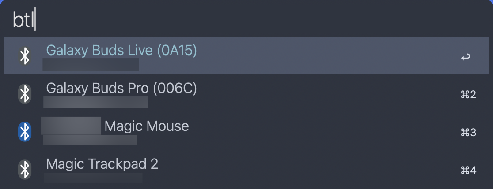
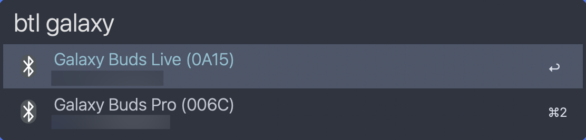
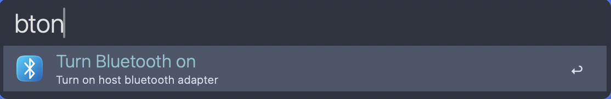
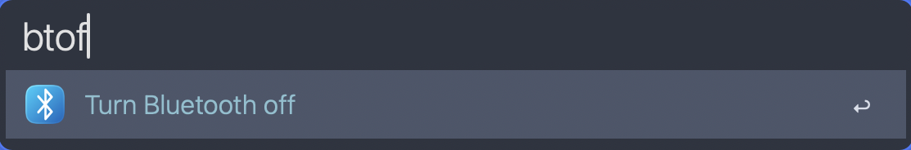

# Alfred Workflow for Controlling Bluetooth Connection

This workflow enables you to manage your Bluetooth device connections and Bluetooth state directly from Alfred. It offers the following functionalities:

* Displays a list of all paired devices along with their connection status (connected or disconnected).
* Connects or disconnects from a paired Bluetooth device.
* Turns Bluetooth on or off for your device.

Compared to other workflows such as [alfred_bluetooth_controller](https://github.com/vegardinho/alfred_bluetooth_controller/), this one:

* Utilizes only JavaScript (JXA - JavaScript for Automations), which is included with every modern MacOS and proven to be stable enough (you all probably remember the pain when apple moved from python2 to python3, right? 😬 ). No need for additional interpreters or external libraries.
* Does not require any external programs like 'blueutil'.
* Leverages native JXA bridges and MacOS APIs, resulting in faster performance compared to workflows relying on external programs.

## Compatibility

I initially developed this workflow for Alfred 4 and it should work seamlessly with both versions 4 and 5. I don't currently have access to Alfred 4, so cannot ensure full compatibility.

Regarding MacOS version and devices: This workflow functions perfectly on my MacBook Air (M1 chip), the latest MacOS versions, and should operate without issue on any M-based Mac. Compatibility with older non-M chips is unverified. Feel free to report bugs or submit pull requests.

## Screenshots

## Installation

1. Download the latest workflow from the 'Releases' page.
2. Double-click the downloaded file to install it.
3. When you first try to use the workflow, you will be prompted for access to the scripting engine. Grant permission to allow the workflow to function properly.
4. Set up your desired keyboard shortcuts (if any).
5. Begin using it.

## Commands

* **btl**: Displays a list of all paired Bluetooth devices and their connection status.
* **bton**: Turns on Bluetooth on your device.
* **btoff**: Turns off Bluetooth on your device.

## Settings

Currently, it supports only one configuration parameter named 'debug level'. The default value is set to 'INFO'. You don't need to modify this unless you encounter issues with the workflow.